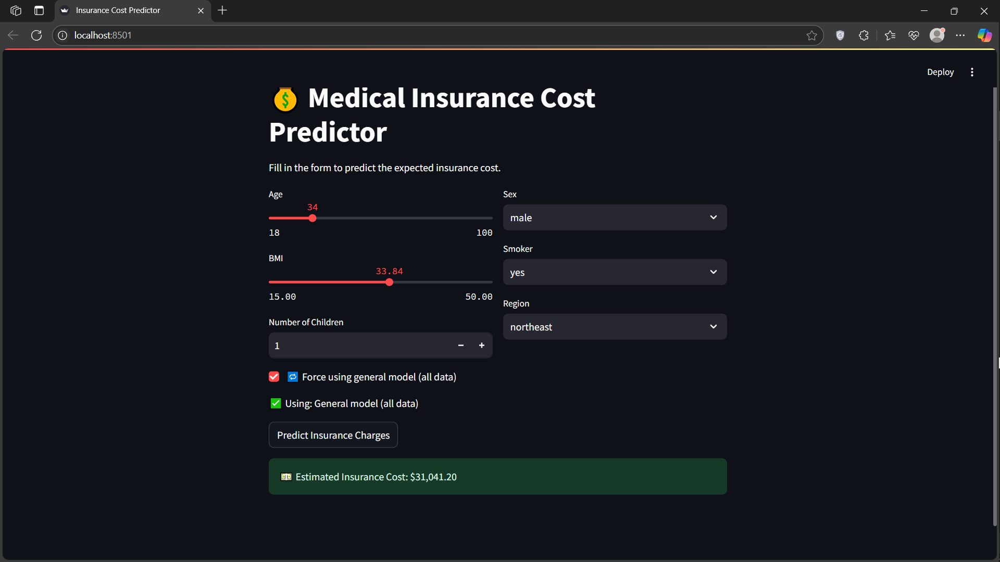
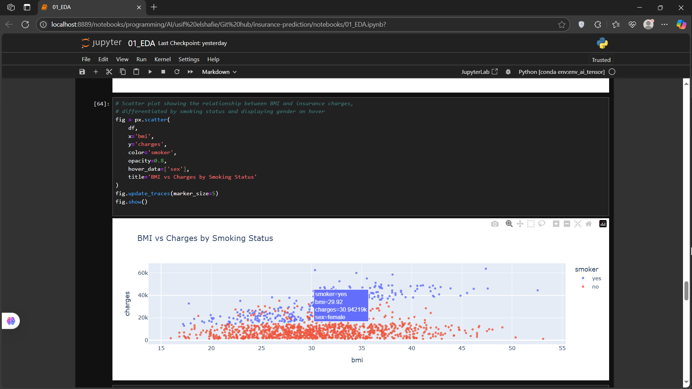

# 💼 Medical Insurance Cost Prediction

A machine learning project that predicts the annual **medical insurance cost** for individuals based on personal and health-related features. Built using **Linear Regression**, **Streamlit**, and **scikit-learn**.

---

## 🔍 Overview

This project demonstrates a full pipeline of:

* Exploratory Data Analysis (EDA)
* Data preprocessing and feature encoding
* Model training (separate models for smokers and non-smokers)
* Model evaluation (RMSE comparison)
* Scalable and interactive **web app** using Streamlit

---

## 🚀 Features

* 🔄 Supports three models:

  * General model trained on all data
  * Specialized model for smokers
  * Specialized model for non-smokers
* ✅ Automatic model selection based on smoking status
* 🔁 Manual override to use the general model
* 📊 User-friendly sliders and dropdowns
* 📦 Trained models saved via `joblib`

---

## 🖼 Screenshots


```md


```

---

## 📂 Project Structure

```
│
├── data/
│   ├── download_data.ipynb
│   └── insurance.csv              
│
├── notebooks/
│   ├── 01_EDA.ipynb                
│   └── 02_Model_Building.ipynb     
│
├── src/
│   └── preprocessing.py            
│
├── app/
│   └── main.py
│
├── requirements.txt                
├── README.md               
        

```

---

## ⚙️ How to Run Locally

1. **Clone the repository**:

```bash
git clone https://github.com/usif elshafi/insurance-prediction.git
cd insurance-prediction
```

2. **Install dependencies**:

```bash
pip install -r requirements.txt
```

3. **Run the app**:

```bash
streamlit run app/main.py
```

---

## 📈 Model Performance

🔹 Results for model All Data:
   MAE  = 4181.19
   RMSE = 5796.28
   R²   = 0.7836

🔹 Results for model  Smokers:
   MAE  = 4774.73
   RMSE = 6697.87
   R²   = 0.7010

🔹 Results for model Non-Smokers:
   MAE  = 2422.00
   RMSE = 4363.45
   R²   = 0.4577

* ➕ Specialized models give better results when segmenting the data

---

## 📁 Dataset Info

* Source: `data/insurance.csv`
* Features:
  * `age`, `sex`, `bmi`, `children`, `smoker`, `region`

* Target:
  * `charges`


---

## 📧 Contact

Made by **Usif Elshafie** — feel free to connect!
